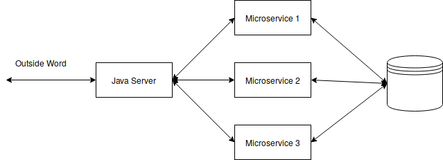

# Backend Introduction

This is an quick Introduction for people who want to contribute too the backend of cryptic-game. This file only shows implementations in Python.

## Structure

The Backend is split into multiple parts called microservices written in Python or Java. They communicate over our libaries with an main server which handels authentication and communication. 



Furthermore he also allows communication between microservices.

## Our Library

see [PyPI](https://pypi.org/project/cryptic-game/)

#### What does it ?

 - Establiches Connection
 - Handels Endpoints
 - Handels Database Connection
 - Outvalidate Input
 
 #### How to use it ?
 
 You can define two types of endpoints the first **user_endpoint** this point is accessable from outside and **microservice_endpoint** which can only be called by other 
 microservices.  
 
 
 ```python
from cryptic import MicroService, get_config, Config
from uuid import uuid4
from sqlalchemy import Column, String
from typing import Union, Dict
from scheme import Text, UUID

config: Config = get_config("debug")  # this sets config to debug mode
ms: MicroService = MicroService(name="echo")
db_wrapper = ms.get_wrapper()

requirement: Dict[str, Text] = {"your_pets_name": Text(required=True), "wallet": UUID()}


@ms.microservice_endpoint(path=["microservice"])
def handle(data: dict, microservice: str):
    return {"myname": "microservice"}


@ms.user_endpoint(path=["user"], requires=requirement)
def handle(data: dict, user: str):
    can_pay: bool = ms.contact_microservice(
        "currency", ["exists"], {"source_uuid": data["wallet"]}
    )["exists"]

    if can_pay:
        mypet: Test = Test.create(data["your_pets_name"])

        return {"uuid": mypet.uuid}
    else:
        return {"error": "you_need_a_valid_wallet"}


class Test(db_wrapper.Base):
    __tablename__: str = "test"

    uuid: Union[Column, str] = Column(String(36), primary_key=True, unique=True)
    name: Union[Column, str] = Column(String(255), nullable=False)

    @staticmethod
    def create(name: str) -> "Test":
        my_test: Test = Test(uuid=str(uuid4()), name=name)

        db_wrapper.session.add(my_test)
        db_wrapper.session.commit()

        return my_test


if __name__ == "__main__":
    ms.run()
```

For the Microservice Endpoint its not necessary to define your requirements other developer of this Project should know
what to send.

All relevant database stuff is stored in a wrapper and can be accessed.

Too contact other microservices use `contact_mircoservice` which takes the name, endpoint, data.

When you have further questions or want more insight ask @SpartanerSpaten.